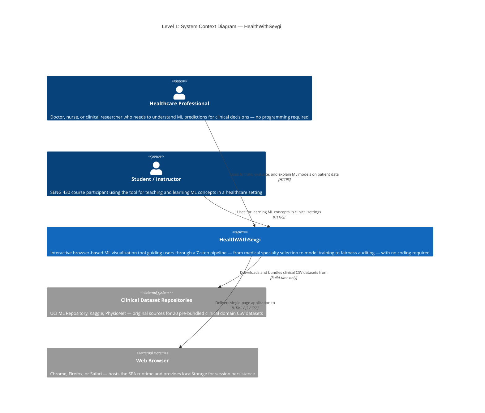
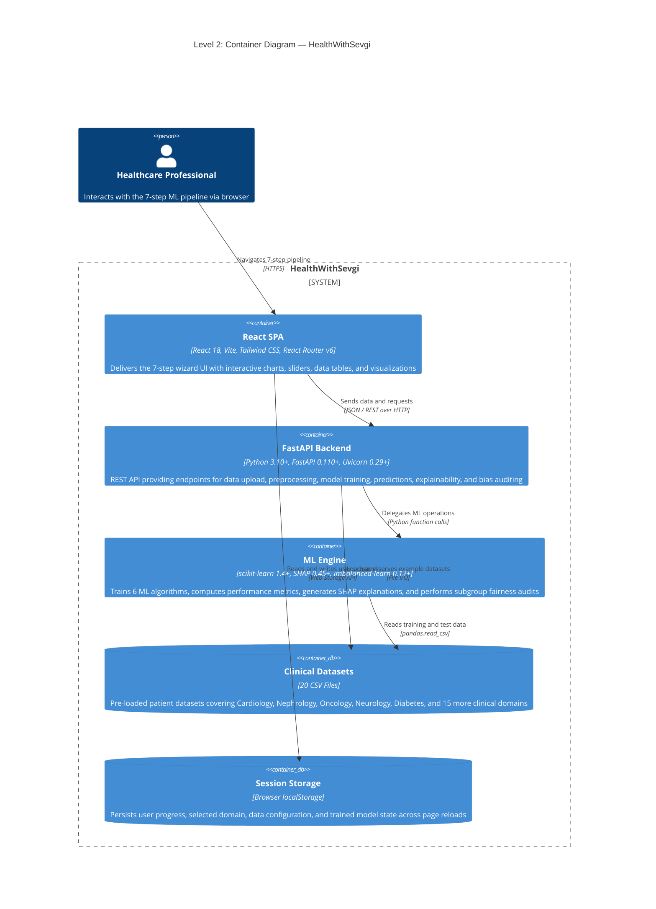
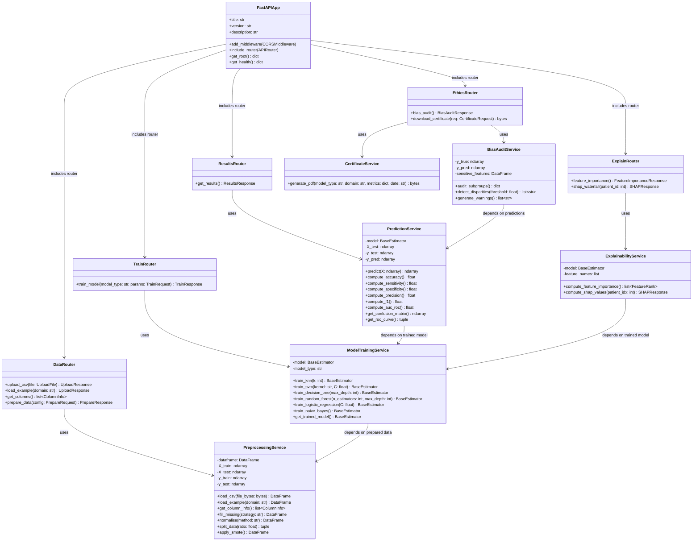
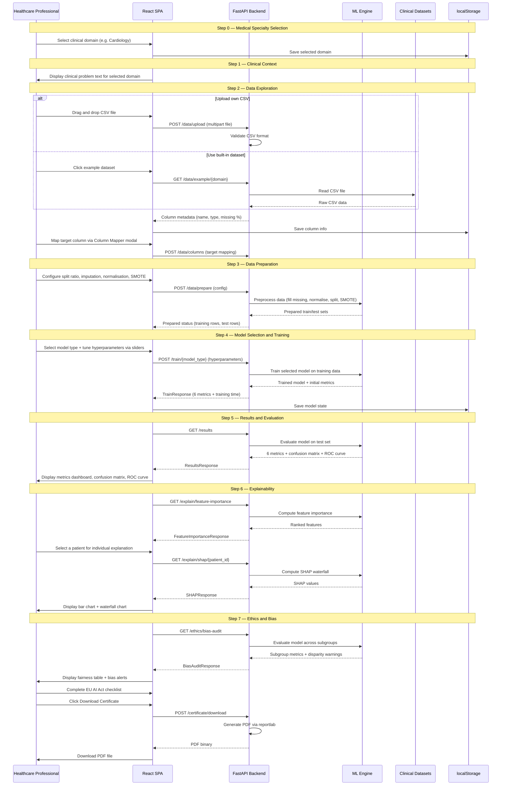

# C4 Architecture Model — HealthWithSevgi

> Architecture documentation following the [C4 model](https://c4model.com) — a hierarchical set of
> software architecture diagrams at four levels of abstraction.
>
> **Project:** HealthWithSevgi — ML Visualization Tool for Healthcare
> **Course:** SENG 430 · Software Quality Assurance · Cankaya University
> **Last Updated:** 2026-02-26

---

## Overview

The C4 model describes software architecture at four zoom levels, like Google Maps for code:

| Level | Diagram | Audience | Shows |
|-------|---------|----------|-------|
| 1 | **System Context** | Everyone | How the system fits into the world |
| 2 | **Container** | Technical stakeholders | High-level technology choices and deployable units |
| 3 | **Component** | Developers and architects | Internal structure of each container |
| 4 | **Code** | Developers | Classes, interfaces, and their relationships |

Each level zooms deeper into the previous one. Start from Level 1 and drill down as needed.

### Diagram Navigation Map

```
Level 1: System Context (this page)
    |
    +-- Level 2: Container Diagram
            |
            +-- Level 3a: FastAPI Backend Components
            |       |
            |       +-- Level 4a: Backend Service Classes
            |       +-- Level 4b: Pydantic Data Models
            |
            +-- Level 3b: React SPA Frontend Components
```

---

## Level 1 — System Context Diagram

> **Scope:** The entire HealthWithSevgi system and its relationship with users and external entities.
>
> **Audience:** Everyone — technical and non-technical stakeholders, including the course instructor.

The System Context diagram shows HealthWithSevgi as a single box, surrounded by the people
who use it and the external systems it depends on. Details inside the box are hidden at this level.



### Key Points — Level 1

- **Healthcare Professional** is the primary persona — the entire UI uses plain clinical language, no code.
- **Student / Instructor** uses the same interface for educational purposes within the SENG 430 course.
- **Clinical Dataset Repositories** are external sources (UCI, Kaggle, PhysioNet). Datasets are downloaded once and bundled with the application — there is **no runtime dependency** on these services.
- **Web Browser** is the deployment target — no desktop installation is needed.
- All patient data stays local — **no data is sent to external servers**.

---

## Level 2 — Container Diagram

> **Scope:** Inside HealthWithSevgi — the major deployable/runnable units and data stores.
>
> **Audience:** Technical stakeholders, architects, and developers.

The Container diagram zooms into HealthWithSevgi and reveals the key technology choices.
Each box is a container — a separately deployable unit or a data store.



### Container Descriptions

| Container | Technology | Responsibility | Port |
|-----------|------------|----------------|------|
| **React SPA** | React 18 + Vite + Tailwind CSS + React Router v6 | Client-side UI — 8 step pages (Step 0-7), stepper navigation, 20-domain pill bar, interactive sliders, charts, and data tables | `localhost:5173` |
| **FastAPI Backend** | FastAPI 0.110+ + Uvicorn 0.29+ (Python 3.10+) | REST API — data upload and validation, preprocessing configuration, model training triggers, results serving, and PDF certificate generation | `localhost:8000` |
| **ML Engine** | scikit-learn 1.4+ + SHAP 0.45+ + imbalanced-learn 0.12+ | Core ML — trains KNN, SVM, Decision Tree, Random Forest, Logistic Regression, Naive Bayes; computes 6 metrics; generates SHAP explanations; runs bias audits | In-process with Backend |
| **Clinical Datasets** | 20 CSV files (sourced from UCI, Kaggle, PhysioNet) | Pre-loaded clinical domain datasets for user exploration and model training | `backend/datasets/` |
| **Session Storage** | Browser localStorage | Client-side persistence of user progress, selected domain, and trained model metadata between page reloads | Browser |

### Communication Paths

| From | To | Protocol | Data Exchanged |
|------|----|----------|----------------|
| React SPA | FastAPI Backend | HTTP REST (JSON) | CSV file upload, preprocessing config, training parameters, result queries, certificate requests |
| FastAPI Backend | ML Engine | Python function calls | pandas DataFrames, model configurations, trained estimator objects |
| ML Engine | Clinical Datasets | File I/O (pandas) | Raw CSV data loaded into DataFrames |
| React SPA | Session Storage | Web Storage API | JSON-serialized user state (selected domain, step progress, config values) |

> **Note:** The ML Engine runs within the same Python process as the FastAPI Backend.
> It is shown as a separate container to highlight the distinct technology layer
> (scikit-learn, SHAP, imbalanced-learn) as required by the course architecture deliverable.

---

## Level 3 — Component Diagrams

> **Scope:** Inside each container — the major structural components and their interactions.
>
> **Audience:** Developers and architects.
>
> **Note:** The components below represent the **planned target architecture**. The project is
> currently in Sprint 1 (planning and scaffolding). Only the FastAPI entry point (`main.py`)
> and CORS middleware exist in the codebase today. All routers, services, and frontend
> components will be implemented in subsequent sprints.

### 3a. FastAPI Backend — Components

This diagram zooms into the **FastAPI Backend** container to show its internal components:
API routers (endpoint handlers) and service classes (business logic).

```mermaid
C4Component
    title Level 3a: Component Diagram — FastAPI Backend

    Container(spa, "React SPA", "React 18", "Frontend application")
    Container(mlEngine, "ML Engine", "scikit-learn + SHAP", "ML algorithms and explainability")
    ContainerDb(datasets, "Clinical Datasets", "CSV Files", "20 domain datasets")

    Container_Boundary(apiBoundary, "FastAPI Backend") {

        Component(cors, "CORS Middleware", "FastAPI CORSMiddleware", "Allows cross-origin requests from React dev server at localhost:5173 and 127.0.0.1:5173")

        Component(dataRouter, "Data Router", "FastAPI APIRouter", "POST /data/upload, GET /data/example/{domain}, GET /data/columns, POST /data/prepare")
        Component(trainRouter, "Train Router", "FastAPI APIRouter", "POST /train/{model_type} — triggers model training with hyperparameters")
        Component(resultsRouter, "Results Router", "FastAPI APIRouter", "GET /results — returns 6 metrics, confusion matrix, ROC curve data")
        Component(explainRouter, "Explain Router", "FastAPI APIRouter", "GET /explain/feature-importance, GET /explain/shap/{patient_id}")
        Component(ethicsRouter, "Ethics Router", "FastAPI APIRouter", "GET /ethics/bias-audit, POST /certificate/download")

        Component(prepService, "Preprocessing Service", "pandas, numpy, imbalanced-learn", "Missing value imputation, normalisation, train/test split, SMOTE oversampling")
        Component(trainService, "Training Service", "scikit-learn", "Instantiates and fits KNN, SVM, DT, RF, LR, NB models with configurable hyperparameters")
        Component(predService, "Prediction Service", "scikit-learn", "Runs predictions on test set and computes Accuracy, Sensitivity, Specificity, Precision, F1, AUC-ROC")
        Component(explainService, "Explainability Service", "SHAP", "Generates feature importance rankings and per-patient SHAP waterfall explanations")
        Component(biasService, "Bias Audit Service", "pandas", "Evaluates model performance across demographic subgroups and flags disparities exceeding 10-point threshold")
        Component(certService, "Certificate Service", "reportlab", "Generates downloadable PDF summary certificates with model name, domain, and all 6 metrics")

        Component(schemas, "Pydantic Schemas", "Pydantic v2", "Type-safe request/response validation models for all API endpoints")
    }

    Rel(spa, cors, "HTTP requests", "JSON / REST")

    Rel(cors, dataRouter, "Routes /data/* requests")
    Rel(cors, trainRouter, "Routes /train/* requests")
    Rel(cors, resultsRouter, "Routes /results requests")
    Rel(cors, explainRouter, "Routes /explain/* requests")
    Rel(cors, ethicsRouter, "Routes /ethics/* requests")

    Rel(dataRouter, prepService, "Delegates data processing")
    Rel(dataRouter, datasets, "Loads CSV files", "File I/O")
    Rel(trainRouter, trainService, "Delegates model training")
    Rel(resultsRouter, predService, "Delegates metric computation")
    Rel(explainRouter, explainService, "Delegates SHAP analysis")
    Rel(ethicsRouter, biasService, "Delegates fairness audit")
    Rel(ethicsRouter, certService, "Delegates PDF generation")

    Rel(trainService, mlEngine, "Uses ML algorithms", "scikit-learn API")
    Rel(predService, mlEngine, "Uses trained models", "scikit-learn API")
    Rel(explainService, mlEngine, "Uses SHAP library", "SHAP API")
    Rel(trainService, prepService, "Receives prepared data")
    Rel(predService, trainService, "Uses trained model object")
    Rel(biasService, predService, "Uses prediction results")

    Rel(dataRouter, schemas, "Validates with")
    Rel(trainRouter, schemas, "Validates with")
    Rel(ethicsRouter, schemas, "Validates with")

    UpdateLayoutConfig($c4ShapeInRow="4", $c4BoundaryInRow="1")
```



#### Router Layer (API Endpoints)

| Router | Endpoints | Input | Output |
|--------|-----------|-------|--------|
| **Data Router** | `POST /data/upload`, `GET /data/example/{domain}`, `GET /data/columns`, `POST /data/prepare` | CSV file, domain name, preprocessing config | Column metadata, row count, prepared data status |
| **Train Router** | `POST /train/{model_type}` | Model type (knn/svm/dt/rf/lr/nb) + hyperparameters | Trained model ID + 6 initial metrics + training time |
| **Results Router** | `GET /results` | — | 6 metrics + confusion matrix (2x2) + ROC curve coordinates |
| **Explain Router** | `GET /explain/feature-importance`, `GET /explain/shap/{patient_id}` | Patient ID (for SHAP) | Feature rankings, SHAP base value + per-feature contributions |
| **Ethics Router** | `GET /ethics/bias-audit`, `POST /certificate/download` | Model results, certificate request | Subgroup performance table + bias warnings, PDF bytes |

#### Service Layer (Business Logic)

| Service | Technology | Responsibility |
|---------|------------|----------------|
| **Preprocessing** | pandas, numpy, imbalanced-learn | Missing value imputation (median / mode / drop), normalisation (z-score / min-max), train/test split, SMOTE oversampling |
| **Training** | scikit-learn | Model instantiation and fitting for all 6 algorithms with user-configured hyperparameters |
| **Prediction** | scikit-learn | Test-set evaluation: Accuracy, Sensitivity, Specificity, Precision, F1, AUC-ROC |
| **Explainability** | SHAP | Global feature importance via permutation importance, individual SHAP waterfall charts |
| **Bias Audit** | pandas | Subgroup performance comparison (gender, age groups), disparity detection (>10 pt threshold), warning generation |
| **Certificate** | reportlab | PDF creation with model name, clinical domain, all 6 metrics, completion date |

---

### 3b. React SPA Frontend — Components

This diagram zooms into the **React SPA** container to show its internal page components,
navigation system, and data management infrastructure.

```mermaid
C4Component
    title Level 3b: Component Diagram — React SPA Frontend

    Container(api, "FastAPI Backend", "Python / FastAPI", "REST API")
    ContainerDb(storage, "Session Storage", "localStorage", "Browser persistence")

    Container_Boundary(spaBoundary, "React SPA Frontend") {

        Component(router, "App Router", "React Router v6", "Manages client-side routing across 8 step pages: /step-0 through /step-7")
        Component(stepper, "Stepper Navigation", "React Component", "Left sidebar showing numbered steps 0-7 with active, completed, and locked visual states")
        Component(pillBar, "Domain Pill Bar", "React Component", "Top navigation bar with 20 clickable medical specialty pills and domain-switch confirmation dialog")

        Component(step0, "Step 0: Specialty Selection", "React Page", "Landing page — 20 medical specialty cards with icons and descriptions")
        Component(step1, "Step 1: Clinical Context", "React Page", "Displays clinical problem introduction text for the selected medical domain")
        Component(step2, "Step 2: Data Exploration", "React Page", "CSV upload drop zone, built-in dataset selector, column summary table with missing value indicators, Column Mapper modal")
        Component(step3, "Step 3: Data Preparation", "React Page", "Train/test split slider, missing value imputation dropdown, normalisation toggle, SMOTE switch")
        Component(step4, "Step 4: Model Selection", "React Page", "6-model picker cards (KNN, SVM, DT, RF, LR, NB), hyperparameter sliders, auto-retrain toggle")
        Component(step5, "Step 5: Results", "React Page", "6 metric cards with green/amber/red thresholds, confusion matrix 2x2 grid, interactive ROC curve chart, low-sensitivity warning banner")
        Component(step6, "Step 6: Explainability", "React Page", "Feature importance horizontal bar chart with clinical names, SHAP waterfall for individual patient explanation")
        Component(step7, "Step 7: Ethics and Bias", "React Page", "Subgroup fairness table with bias alerts, EU AI Act compliance checklist (8 items), PDF certificate download button")

        Component(apiClient, "API Client", "Axios or Fetch", "Centralised HTTP client wrapping all backend REST calls with base URL config and error handling")
        Component(hooks, "Custom Hooks", "React Hooks", "useDataUpload, useMLModel, useSessionStorage, useMetrics — encapsulate data fetching and state management")
        Component(sessionMgr, "Session Manager", "JavaScript module", "Reads and writes user progress and configuration to browser localStorage with JSON serialisation")
    }

    Rel(stepper, router, "Navigate between steps")
    Rel(pillBar, router, "Trigger domain change and page reset")

    Rel(router, step0, "Routes /step-0")
    Rel(router, step1, "Routes /step-1")
    Rel(router, step2, "Routes /step-2")
    Rel(router, step3, "Routes /step-3")
    Rel(router, step4, "Routes /step-4")
    Rel(router, step5, "Routes /step-5")
    Rel(router, step6, "Routes /step-6")
    Rel(router, step7, "Routes /step-7")

    Rel(step2, apiClient, "Upload CSV / load example dataset")
    Rel(step3, apiClient, "Send preprocessing configuration")
    Rel(step4, apiClient, "Send model type and hyperparameters")
    Rel(step5, apiClient, "Fetch performance results")
    Rel(step6, apiClient, "Fetch feature importance and SHAP data")
    Rel(step7, apiClient, "Fetch bias audit / request PDF certificate")

    Rel(apiClient, api, "REST API calls", "JSON over HTTP")
    Rel(hooks, sessionMgr, "Read and write session state")
    Rel(sessionMgr, storage, "Persist data", "Web Storage API")

    UpdateLayoutConfig($c4ShapeInRow="4", $c4BoundaryInRow="1")
```



#### Navigation Components

| Component | Purpose | Key Features |
|-----------|---------|--------------|
| **App Router** | Client-side routing | 8 routes (`/step-0` through `/step-7`), lazy loading of pages |
| **Stepper Navigation** | Step progress sidebar | Steps 0-7, active/completed/locked states, click to navigate |
| **Domain Pill Bar** | Specialty selector | 20 domain pills, confirmation dialog on domain switch (prevents accidental progress loss) |

#### Page Components (Steps 0-7)

| Step | Page | Key UI Elements |
|------|------|----------------|
| 0 | Specialty Selection | 20 domain cards with icons, specialty descriptions |
| 1 | Clinical Context | Domain-specific medical problem text, patient population info, target outcome |
| 2 | Data Exploration | CSV drag-and-drop zone, built-in dataset selector, column summary table, Column Mapper modal |
| 3 | Data Preparation | Train/test split slider (sums to 100%), imputation dropdown (median/mode/drop), normalisation toggle (z-score/min-max), SMOTE switch |
| 4 | Model Selection | 6-model picker (KNN, SVM, DT, RF, LR, NB), per-model hyperparameter sliders, auto-retrain toggle |
| 5 | Results | 6 metric cards (Accuracy, Sensitivity, Specificity, Precision, F1, AUC) with colour thresholds, confusion matrix 2x2, ROC curve, low-sensitivity warning |
| 6 | Explainability | Feature importance bar chart (clinical names), SHAP waterfall per patient (red=risk, green=protective) |
| 7 | Ethics and Bias | Subgroup fairness table (gender, age), bias alerts (>10pt threshold), EU AI Act checklist (8 items, 2 pre-checked), PDF certificate download |

#### Infrastructure Components

| Component | Technology | Purpose |
|-----------|------------|---------|
| **API Client** | Axios or Fetch | Centralised HTTP wrapper — base URL (`VITE_API_URL`), error handling, response parsing |
| **Custom Hooks** | React Hooks | `useDataUpload`, `useMLModel`, `useSessionStorage`, `useMetrics` — encapsulate async data logic |
| **Session Manager** | localStorage wrapper | JSON serialisation/deserialisation of user progress across page reloads |

---

## Level 4 — Code Diagrams

> **Scope:** Key classes, modules, and their relationships within the backend services.
>
> **Audience:** Developers.
>
> **Note:** The C4 model considers Level 4 optional. These diagrams show the planned
> class and module structure for the most critical parts of the system.

### 4a. Backend Services — Class Structure

This class diagram shows the planned Python classes for the FastAPI backend,
covering the router layer, service layer, and their dependencies.



### 4b. Pydantic Schemas — Data Models

This class diagram shows the Pydantic v2 models used for request validation
and response serialisation across all API endpoints.

```mermaid
classDiagram
    class ColumnInfo {
        +name: str
        +dtype: str
        +missing_percent: float
        +unique_values: int
        +action_tag: str
    }

    class UploadResponse {
        +columns: list~ColumnInfo~
        +rows: int
        +filename: str
        +size_bytes: int
    }

    class PrepareRequest {
        +train_test_split: float
        +missing_value_strategy: str
        +normalisation: str
        +apply_smote: bool
    }

    class PrepareResponse {
        +status: str
        +training_rows: int
        +test_rows: int
    }

    class TrainRequest {
        +hyperparameters: dict
        +auto_retrain: bool
    }

    class TrainResponse {
        +model_id: str
        +accuracy: float
        +sensitivity: float
        +specificity: float
        +precision: float
        +f1_score: float
        +auc_roc: float
        +training_time_ms: int
    }

    class ROCData {
        +fpr: list~float~
        +tpr: list~float~
        +thresholds: list~float~
    }

    class ResultsResponse {
        +metrics: TrainResponse
        +confusion_matrix: list~list~
        +roc_curve: ROCData
    }

    class FeatureRank {
        +feature: str
        +importance: float
        +rank: int
    }

    class FeatureImportanceResponse {
        +features: list~FeatureRank~
    }

    class SHAPFeature {
        +feature: str
        +value: float
        +shap_value: float
        +direction: str
    }

    class SHAPResponse {
        +base_value: float
        +features: list~SHAPFeature~
    }

    class BiasSubgroupMetrics {
        +accuracy: float
        +sensitivity: float
        +specificity: float
    }

    class BiasAuditResponse {
        +subgroups: dict
        +bias_warnings: list~str~
    }

    class CertificateRequest {
        +model_type: str
        +domain: str
    }

    UploadResponse *-- ColumnInfo : contains
    ResultsResponse *-- TrainResponse : includes metrics
    ResultsResponse *-- ROCData : includes curve data
    FeatureImportanceResponse *-- FeatureRank : contains
    SHAPResponse *-- SHAPFeature : contains
    BiasAuditResponse *-- BiasSubgroupMetrics : per subgroup
```



---

## Data Flow — End-to-End Pipeline

This sequence shows how data flows through the system across all 7 steps:



---

## References

- [C4 Model — Simon Brown](https://c4model.com)
- [The C4 Architecture Model — InfoQ](https://www.infoq.com/articles/C4-architecture-model/)
- [Mermaid C4 Diagram Syntax](https://mermaid.js.org/syntax/c4.html)
- [Mermaid Sequence Diagram Syntax](https://mermaid.js.org/syntax/sequenceDiagram.html)
