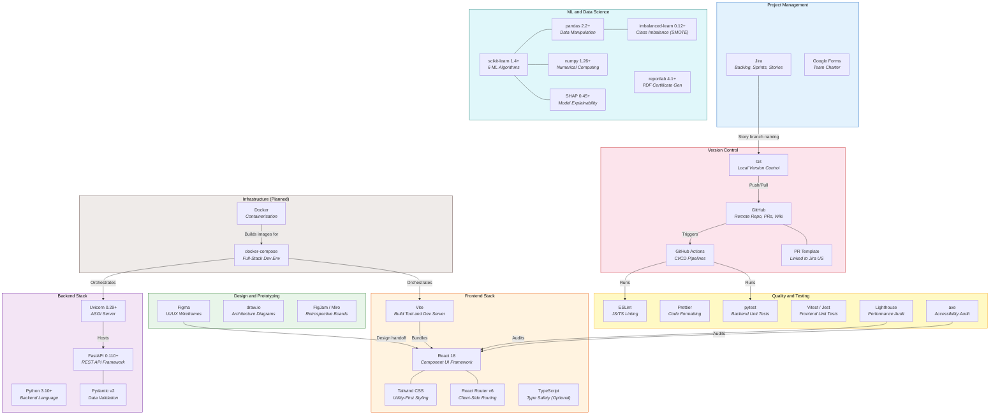
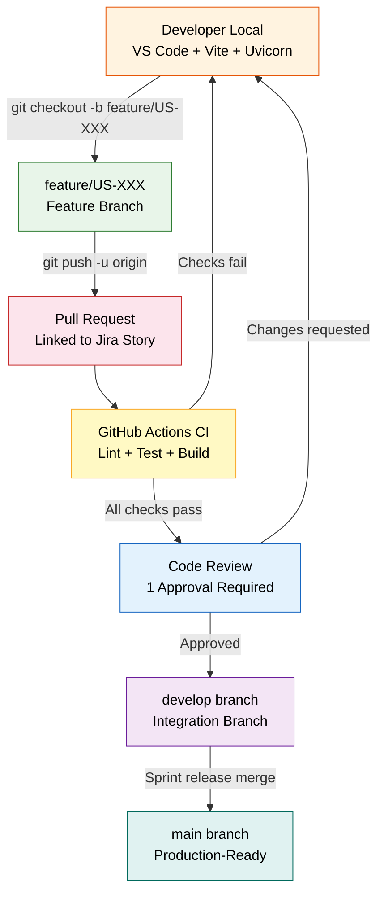
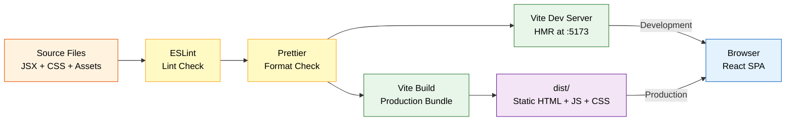
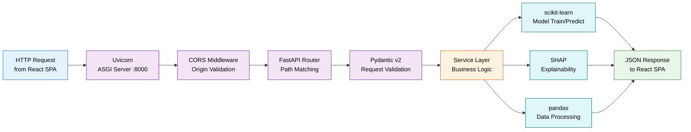
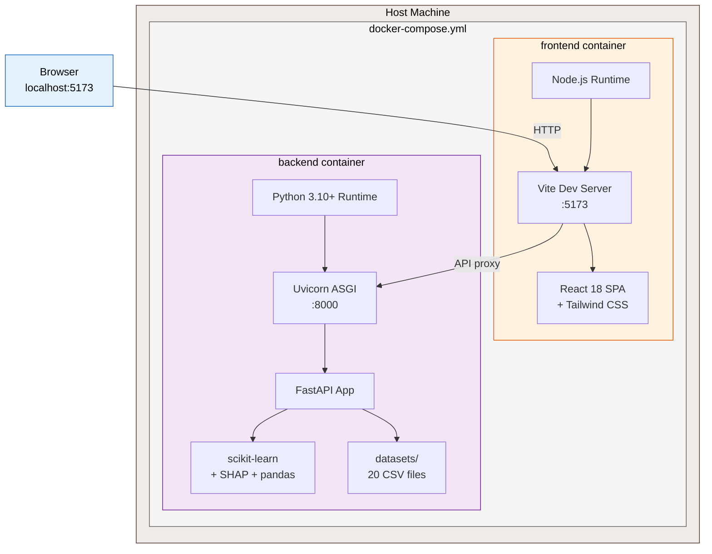

# Development Toolchain — HealthWithSevgi

> This document visualises the complete development toolchain used across the
> HealthWithSevgi project lifecycle — from design and planning through development,
> testing, and deployment.
>
> **This is NOT a C4 diagram.** It shows tools and their relationships in the development
> workflow, not the runtime software architecture.
>
> **Project:** HealthWithSevgi — ML Visualization Tool for Healthcare
> **Course:** SENG 430 · Software Quality Assurance · Cankaya University
> **Last Updated:** 2026-02-26

---

## Toolchain Overview

The toolchain is organized into seven functional categories. Each tool serves a specific
role in the software development lifecycle.

---

## Development Lifecycle Pipeline

This diagram shows the flow of work through the toolchain — from requirements
to deployment — and which tools are used at each stage.

```mermaid
graph LR
    subgraph PLAN["1. Plan"]
        A1["Jira<br/>Create User Stories"]
        A2["Jira<br/>Sprint Planning"]
        A3["Jira<br/>Estimate Points"]
    end

    subgraph DESIGN2["2. Design"]
        B1["Figma<br/>Create Wireframes"]
        B2["Figma<br/>Design Review"]
        B3["Figma<br/>Instructor Approval"]
    end

    subgraph DEVELOP["3. Develop"]
        C1["Git<br/>Create Feature Branch"]
        C2["VS Code<br/>Write Code"]
        C3["Vite / Uvicorn<br/>Run Dev Servers"]
        C4["ESLint + Prettier<br/>Auto-Format"]
    end

    subgraph TEST["4. Test"]
        D1["pytest<br/>Backend Unit Tests"]
        D2["Vitest<br/>Frontend Unit Tests"]
        D3["Lighthouse<br/>Performance Score"]
        D4["axe<br/>Accessibility Check"]
    end

    subgraph REVIEW["5. Review"]
        E1["GitHub<br/>Create Pull Request"]
        E2["GitHub<br/>Code Review"]
        E3["GitHub Actions<br/>CI Checks"]
    end

    subgraph DEPLOY["6. Deploy"]
        F1["Docker<br/>Build Images"]
        F2["docker-compose<br/>Start Full Stack"]
        F3["Uvicorn<br/>Serve API"]
    end

    subgraph RETRO["7. Retrospect"]
        G1["Miro / FigJam<br/>Keep-Improve-Try"]
        G2["GitHub Wiki<br/>Meeting Notes"]
        G3["Jira<br/>Velocity Review"]
    end

    PLAN --> DESIGN2
    DESIGN2 --> DEVELOP
    DEVELOP --> TEST
    TEST --> REVIEW
    REVIEW --> DEPLOY
    DEPLOY --> RETRO
    RETRO -->|"Next Sprint"| PLAN

    style PLAN fill:#e3f2fd,stroke:#1565c0,color:#000
    style DESIGN2 fill:#e8f5e9,stroke:#2e7d32,color:#000
    style DEVELOP fill:#fff3e0,stroke:#e65100,color:#000
    style TEST fill:#fff9c4,stroke:#f9a825,color:#000
    style REVIEW fill:#fce4ec,stroke:#c62828,color:#000
    style DEPLOY fill:#f3e5f5,stroke:#6a1b9a,color:#000
    style RETRO fill:#e0f7fa,stroke:#00695c,color:#000
```

---

## Branch and CI/CD Workflow

This diagram shows how code flows from a developer's local environment
through the Git branching strategy to production.

---

## Frontend Build Pipeline

This diagram shows how the frontend source code is transformed
into production-ready static assets.

---

## Backend Runtime Pipeline

This diagram shows how a request flows through the backend technology stack
from the frontend to the ML engine and back.

---

## Docker Containerisation (Planned)

This diagram shows the **planned** Docker and docker-compose setup that will package
the full-stack application into containers. This is a Sprint 1 deliverable (D-013).

---

## Complete Tool Reference

### Design and Collaboration

| Tool | Category | Purpose | Deliverable |
|------|----------|---------|-------------|
| **Figma** | UI/UX Design | Wireframes and high-fidelity mockups for all 7 steps, clickable prototype | Shared Figma link per sprint |
| **draw.io** | Architecture Diagrams | Architecture diagrams exported as PDF (alternative to Figma for diagrams) | PDF in docs or GitHub Wiki |
| **FigJam / Miro** | Retrospectives | Sprint retrospective boards (Keep / Improve / Try) | Screenshot in GitHub Wiki |
| **Google Forms** | Team Management | Team charter submission | Google Form response |

### Project Management

| Tool | Category | Purpose | Deliverable |
|------|----------|---------|-------------|
| **Jira** | Agile PM | Product backlog, sprint backlog, user stories, story points, velocity tracking, burndown | Shared board link for instructor |

### Version Control and CI/CD

| Tool | Category | Purpose | Deliverable |
|------|----------|---------|-------------|
| **Git** | VCS | Local version control, branching (`feature/US-XXX`), commits | Commit history |
| **GitHub** | Remote VCS | Repository hosting, pull requests, code review, branch protection | GitHub repo link |
| **GitHub Wiki** | Documentation | Architecture decisions, meeting notes, API docs, sprint notes | GitHub Wiki tab |
| **GitHub Actions** | CI/CD | Automated linting, testing, and build verification on every PR | Workflow status badges |
| **PR Template** | Process | Standardised PR format linked to Jira user stories | `.github/pull_request_template.md` |

### Frontend Technologies

| Tool | Version | Purpose | Configuration |
|------|---------|---------|---------------|
| **React** | 18.x | Component-based UI framework | — |
| **Vite** | Latest | Fast build tool with HMR, dev server at `:5173` | `vite.config.js` |
| **Tailwind CSS** | Latest | Utility-first CSS, green theme (`#16a34a` primary) | `tailwind.config.js` |
| **React Router** | v6 | Client-side routing for 8 step pages | `App.jsx` |
| **TypeScript** | Optional | Type safety for frontend code | `tsconfig.json` |
| **ESLint** | Latest | JavaScript/TypeScript linting | `.eslintrc.js` (to be configured) |
| **Prettier** | Latest | Consistent code formatting | `.prettierrc` (to be configured) |

### Backend Technologies

| Tool | Version | Purpose | Configuration |
|------|---------|---------|---------------|
| **Python** | 3.10+ | Backend programming language | — |
| **FastAPI** | 0.110+ | REST API framework with auto-generated OpenAPI docs at `/docs` | `app/main.py` |
| **Uvicorn** | 0.29+ | ASGI server with hot-reload for development | `--reload --port 8000` |
| **Pydantic** | v2 (2.6+) | Request/response data validation and serialisation | `app/models/schemas.py` |
| **python-multipart** | 0.0.9+ | Multipart file upload support for CSV files | `requirements.txt` |

### ML and Data Science

| Tool | Version | Purpose | Models/Features |
|------|---------|---------|-----------------|
| **scikit-learn** | 1.4+ | Core ML algorithms | KNN, SVM, Decision Tree, Random Forest, Logistic Regression, Naive Bayes |
| **pandas** | 2.2+ | Data manipulation and analysis | DataFrame operations, CSV I/O, missing value handling |
| **numpy** | 1.26+ | Numerical computing | Array operations, metrics computation |
| **SHAP** | 0.45+ | Model explainability | Feature importance rankings, per-patient waterfall explanations |
| **imbalanced-learn** | 0.12+ | Class imbalance handling | SMOTE oversampling for training data |
| **reportlab** | 4.1+ | PDF generation | Summary certificate with model results and completion date |

### Quality and Testing

| Tool | Category | Purpose | Target |
|------|----------|---------|--------|
| **pytest** | Backend Testing | Unit tests for API endpoints, services, and ML pipeline | Coverage target: 80%+ |
| **Vitest / Jest** | Frontend Testing | Unit tests for React components and hooks | Coverage target: 70%+ |
| **Lighthouse** | Performance | Performance audit score | Target: 80+ |
| **axe** | Accessibility | WCAG AA compliance, contrast ratio 4.5:1, keyboard navigation | Full compliance |
| **Google Forms / Maze** | User Testing | Usability testing with non-CS participants (Weeks 9-10) | PDF of feedback forms |

### Infrastructure (Planned — to be configured in Sprint 1)

| Tool | Category | Purpose | Configuration |
|------|----------|---------|---------------|
| **Docker** | Containerisation | Package backend into reproducible containers | `Dockerfile` (to be created) |
| **docker-compose** | Orchestration | Single command (`docker-compose up`) to start full stack | `docker-compose.yml` (to be created) |

### Typography (Design System)

| Font | Usage | Weight Variants |
|------|-------|-----------------|
| **DM Sans** | Primary UI text | Light, Regular, Medium, SemiBold, Bold |
| **DM Mono** | Code and data display | Regular, Medium |
| **Fraunces** | Heading serif accents | Regular, SemiBold |

---

## References

- [HealthWithSevgi Sprint 1 Assignment](../Sprint_1_Assignment.md) — Required toolchain table
- [C4 Architecture Diagrams](./c4-architecture.md) — Runtime software architecture (separate from this toolchain)
- [Mermaid Flowchart Syntax](https://mermaid.js.org/syntax/flowchart.html)
